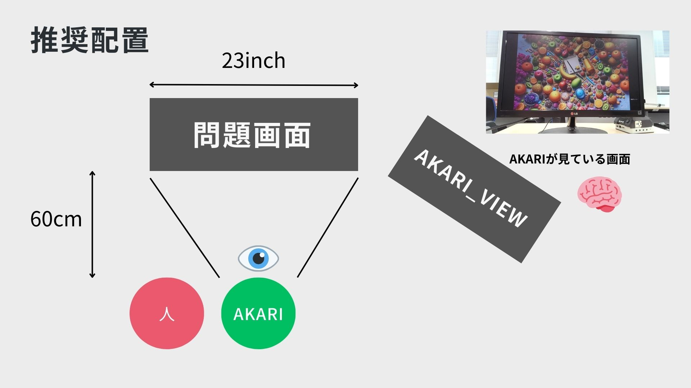

# akari_treasure_hant
AKARIと宝探しゲームで勝負できるアプリです。  

## セットアップ方法
1. submoduleの更新  
`git submodule update --init`  
2. 仮想環境の作成  
`python3 -m venv venv`  
`. venv/bin/activate`  
`pip install -r requirements.txt`  
## 配置方法

## 起動方法
1. `. venv/bin/activate`  
を実施後、下記を実行。  

2. 問題を別ウィンドウにて起動

3. 物体認識を実行する  
`python3 treasure_hunt.py`

## その他
このアプリケーションは愛知工業大学 情報科学部 知的制御研究室により作成されたものです。  
