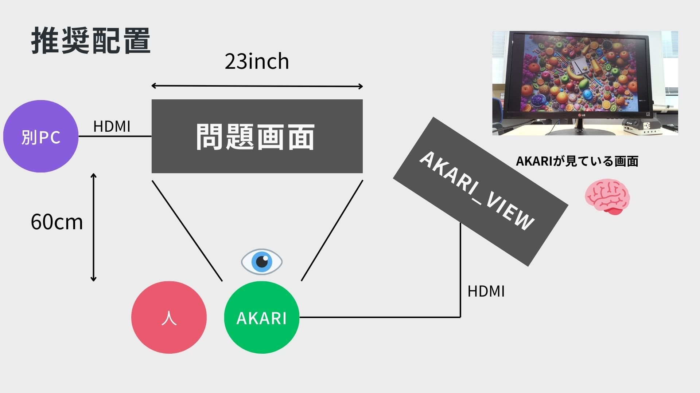

# akari_treasure_hunt
AKARIと宝探しゲームで勝負できるアプリです。  

## セットアップ方法
1. ローカルにクローンする  
`cd ~`  
`git clone https://github.com/AkariGroup/akari_treasure_hunt.git`  
`cd akari_treasure_hunt.git`  
2. submoduleの更新  
`git submodule update --init`  
3. 仮想環境の作成  
`python3 -m venv venv`  
`. venv/bin/activate`  
`pip install -r requirements.txt`  
## 配置方法

## 起動方法
1. 仮想環境の有効化  
`. venv/bin/activate`

2. 問題を別PCにて起動。またはハブを使用しHDMI端子を増設し別モニターにて起動  
questionsディレクトリから candy.mp4 もしくは key.mp4を選択して画面に映す

3. 物体認識を実行する
`python3 treasure_hunt.py`

4. 物体認識を終了する  
AKARIが見ている画面が表示されているタブを選択肢`q`を押す。

## その他
このアプリケーションは愛知工業大学 情報科学部 知的制御研究室により作成されたものです。  
